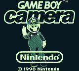
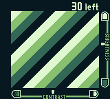

# Game Boy Camera

The Camera is a **cartridge**, not a link accessory. Cart type `$FC`: 1 MB of
ROM, 128 KB of battery RAM for the photo album, and an M64282FP image sensor on
the cartridge bus. It shares nothing with the printer's code path.




## Where this stands

**Done.** The mapper. The cartridge boots, the menus work, the minigames run,
the viewfinder is live, captures reach the album and the counter decrements.

**Not done.** The M64282FP sensor model. Captures currently develop a
deliberately synthetic diagonal gradient, which is what the viewfinder above is
showing. It is obviously fake on purpose: nobody should mistake it for a working
camera.

## The mapper

```text
  $0000-$1FFF   write $0A to enable RAM WRITES
  $2000-$3FFF   ROM bank, $00-$3F
  $4000-$5FFF   RAM bank $00-$0F, or BIT 4 SET to select the camera registers
  $A000-$BFFF   the album, or the registers, mirrored every $80 bytes
```

Registers: `$A000` is trigger and status, `$A001` gain and edge mode,
`$A002-$A003` exposure (MSB first), `$A004` output reference and edge ratio and
invert, `$A005` output reference and zero point calibration, and `$A006-$A035`
a 4 by 4 dither matrix at three bytes per element. Everything except `$A000` is
write-only and reads back `$00`.

### Two bugs this cost, both of which looked like something else

**`$A000` bit 0 is the trigger going in and the BUSY flag coming out.** Storing
what the game wrote and returning it meant the bit never cleared, so the
cartridge sat at `$4B85` polling forever with the LCD off. That is
indistinguishable from having no mapper at all.

**Reads are NOT gated by the RAM enable.** The spec says "write $0A to enable RAM
*writes*... reading and register writes are always enabled". Gating reads too
made every read return `$FF` before the game enabled RAM, which is both
bitplanes set, which is colour 3, which is a **black viewfinder**. That looks
exactly like "no camera is attached", which is what everyone assumed it was.

The second one is the more instructive: the wrong explanation was available, it
was reasonable, and it was believed. What broke the tie was that a placeholder
pattern *should* have been visible, so the expectation being violated was the
evidence, not the screen.

## Getting a photo out

There is deliberately **no PNG export for photos**. Captures go into the
cartridge RAM album, which the frontend already persists as save RAM, so a photo
survives exactly like any other save.

The Camera's own way of getting a picture out of the cartridge is to **print
it**, and the printer is already supported and is game-agnostic. So a printed
Camera photo should land in `<save_dir>/printer/` as a PNG like any other
printout, with no new code and no second export path to keep consistent. See
`PRINTER.md`.

## The sensor interface, when it is written

Nothing here exists yet. It is written down now so that the constraints survive,
because most of them were established in conversation and would otherwise be
rediscovered the expensive way.

**Use the standard libretro interface, not a bespoke one.**
`RETRO_ENVIRONMENT_GET_CAMERA_INTERFACE` is `26 | RETRO_ENVIRONMENT_EXPERIMENTAL`,
which is `$1001A`. The bare number is not it, and this repository already carries
a comment about an environment id sent without the experimental bit taking the
whole app down. Using the standard means it also works in any other libretro
frontend.

**It is a PUSH, and that differs from the microphone.** The host's microphone
path is a pull: a Kotlin thread fills a ring buffer and the core drains it with
`read_mic` during `retro_run`. The camera interface inverts that: the **core**
registers a frame callback and the **frontend** calls it, on the `retro_run`
thread. Anyone building the Android half by analogy with the mic will build the
wrong shape.

**The core wants light, not pictures.** A greyscale frame, 128 by 112, and
nothing else. Exposure, gain, edge enhancement and dithering all happen here,
from the registers the game writes, which is precisely what makes the in-game
brightness and contrast sliders do something real. Pre-converting to Game Boy
shades outside the core would make those controls meaningless.

**Frames arrive UNMIRRORED, in sensor orientation.** This is the one that would
be discovered late and painfully. Phone front cameras conventionally mirror the
*preview*, because people expect to aim like a mirror. The real Game Boy Camera
mirrored nothing; the lens saw what it saw. A mirrored frame means anything with
text in it develops backwards, and it develops backwards **in a print**, which is
the artifact somebody keeps. A frontend should mirror its preview only and hand
over the unmirrored frame.

**There is no front/back lens concept.** The real cartridge had one sensor on a
180 degree swivel, so pointing it at yourself was physical and the game never
knew. There is no register for it, so the interface carries no lens identifier.
Which lens produced a frame is the frontend's business, exactly as which
microphone is today.

**The frontend crops, not the core.** 128 by 112 is 8:7; phone sensors are 4:3
or 16:9, so something has to crop. It has to be the frontend, and not for
convenience: **the crop has to match the preview.** The preview is what the
player aims with, so if the core cropped differently the viewfinder would be
lying about what the photo will contain. Whoever draws the preview must decide
the crop.

## Testing

`crates/gb-core/tests/camera.rs`, skipped when the ROM is absent since a
commercial cartridge cannot be committed. Put it at
`dumps/roms/Game Boy Camera (USA, Europe) (SGB Enhanced).gb`.

- the LCD comes on and the PC stays inside the cartridge;
- the title screen draws more than three distinct colours, because "the LCD is
  on" and "there is a picture" are different claims;
- the viewfinder shows more than one shade in the **middle** of the screen. The
  middle only: the brightness and contrast sliders at the edges draw whether or
  not a capture worked, so they are not evidence.
