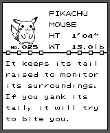

# Game Boy Printer

The core emulates a Game Boy Printer on the link port and writes what it prints
as PNG files. This is the contract between the core and whatever surfaces those
files, written down so it does not drift.



That image is a real printout, produced by Pokemon Yellow through this core, and
it is committed here as a sample: it is byte for byte what the core writes at
runtime, so it can be used to test a decode, a gallery save or a share sheet
without needing the ROM or a save state.

## Turning it on

A libretro core option, **on by default**:

```
key     pocketrust_printer
values  on | off        (lower case, exactly these strings)
```

There is deliberately no user-facing toggle. The accessory is a pure slave and,
because it idles as open bus (below), a game that never prints cannot tell it is
attached. There is nothing for a player to decide, so a frontend that has not
read our options at all still gets a working printer.

### It idles as an empty port

While no packet is in progress the printer answers **`$FF`**, not `$00`. This
matters because the printer can be left plugged in permanently, so every game
that pokes the serial port meets it, not only the ones that print. An unplugged
Game Boy reads `$FF` back, and a game hunting for a link partner uses exactly
that to decide nobody is there. Answering `$00` while idle would tell Pokemon's
Cable Club that *something* is on the wire, and the failure would land on
trading rather than on printing.

A real printer does answer `$00` there. The deviation is one byte, only ever the
first of a packet, and only when the printer was not already mid-packet; games
read the reply at the trailer, not at the magic. Verified by printing a Pokedex
entry with it in place.

**A live GameLink session outranks it.** If one is up, the cable is a person and
the printer setting is ignored until that session ends. A front end that offers
both as toggles should disable or explain the printer one while a session is
live, rather than leaving a control that silently does nothing.

GameLink and netplay are **not** synonyms here, and the difference decides
whether that paragraph applies to you. Netplay means deterministic input
lockstep, and Game Boy does not have it: Trophy Hub's `netplayReady` list is
NES, SNES, Mega Drive, PS1, N64 and friends, with no Game Boy slot in it.
GameLink is the serial tunnel, carried over the libretro netpacket interface
this core implements, and Game Boy very much does have it: it has been the
default GB/GBC link path since PocketRust graduated on 2026-08-04, and 0.10.28
shipped cross-device trading on it.

So this is a real conflict a user can reach, not a defensive branch. Two people
mid-trade is exactly when a silently dead printer toggle would be noticed.

## Where the files go

```
<save directory>/printer/<CARTRIDGE TITLE> print NNN.png
```

**The subdirectory is load bearing.** On Android the save directory and the
system directory are the same path, and that path is the shared support tree for
every core in the app: BIOS images, Dolphin's `Sys`, PCSX2 resources. User
pictures must not be mixed into that, or a future "clear my prints" becomes a
dangerous thing to write.

`NNN` rises and never overwrites. The cartridge title is sanitised to
alphanumerics, spaces and dashes, so a corrupt or hostile header cannot write
outside the directory.

## The file

A PNG, 160 pixels wide, **2-bit indexed** with a four-entry palette running
white to black. That is exactly what the printer produces: four greys at the
resolution the hardware actually had. A full Pokedex printout is about 8 KB.

It is deliberately *not* converted to RGB or upscaled. This is the authentic
artifact and it is lossless; anything a destination needs beyond it, a larger
image for a social app or RGB for a chat client, is a rendering decision at the
point of sharing rather than a property of the file. Converting in the encoder
would throw information away for every consumer to suit one of them.

The encoder is hand written in `gb-core` rather than pulled in as a dependency,
because the libretro core has none and a printed page is not a good enough
reason to give it one. It uses stored deflate blocks, which PNG permits and
every decoder accepts.

## If you scale it for sharing, scale it by an integer, with no smoothing

The core writes the lossless original at native size, and any enlarging belongs
at the point of sharing, from that original. Two rules if you do it.

**Nearest neighbour, never bilinear.** The picture is ordered dither: a
high-frequency pattern of hard single-pixel transitions that is doing the work
of tonal shading. Any smoothing filter averages that pattern back into flat
grey, which destroys precisely the thing that makes it look like a Game Boy
Camera photograph rather than a small blurry one. On Android this is the
default-wrong case: an `ImageView` will smooth it unless told not to.

**An integer multiple, or not at all.** 160x144 times four is 640x576, times six
is 960x864. A non-integer scale gives some source pixels more output pixels than
others, so a uniform dither pattern comes out visibly uneven and the image reads
as damaged rather than as enlarged.

Neither rule is a preference. The artifact is pixels, and both of the obvious
defaults destroy them.

## One printout, not one print command

**A Pokedex entry is two print commands.** The first ends with a paper feed of
zero and the second begins with one, and on real paper that means a single
continuous strip. The core joins them, in `gb_core::stitch`, and hands over one
image per *physical* printout.

This lives in the core on purpose. The margin rule is protocol knowledge, and
four clients each reimplementing it is three of them getting it subtly wrong.
Saving each print command separately turns one picture into fragments.

**A file appears when a printout is complete, and that is the whole contract.**
A frontend should announce one print per file and never try to work out which
files belong together.

### What happens if the continuation never comes

A page whose margins say "continuous" is **held**, and released when the printer
has been silent for five seconds (`IDLE_FLUSH_FRAMES`). So a print that the
player cancelled, or that a crashed cartridge abandoned, still lands: late, but
it lands, and it lands as its own file.

Five seconds of silence, rather than a fixed delay since the print, because the
two pages of a Pokedex entry are **750 frames apart**, twelve and a half
seconds, while the second page's eight data packets crawl over an 8192 Hz link.
Any fixed timeout long enough for that would make every abandoned print wait an
age. Within a job the printer is never quiet for more than about a second, so
silence separates "still working" from "gone" cleanly.

A game being unloaded also releases anything held.

### How this went wrong once

`stitch` takes every page and joins them, which is right when you have them all.
The libretro core called it **once a frame**, so it never held more than one page
and joined nothing; every Pokedex entry shipped as two files. The command-line
tool collected everything first and looked perfect. Same function, opposite
behaviour, and it surfaced on a phone rather than in a test.

`stitch` is now written in terms of `Spool`, the live assembler, so there is one
rule instead of two that agree until they do not. `gbprint` drains once a frame
exactly as the core does, because a tool that exercises a different path from the
thing it is testing is worse than no tool.

## Fixed: no printer on any game after the first

If a second game was loaded, or a game was reset, it got **no printer at all**,
which Pokemon reports as "Printer Error 2". Restarting the app was the only cure,
which is exactly what made it look like a printer fault rather than a lifecycle
one.

`reconcile_netlink` short-circuits when the device it wants is the device it
already has. That is correct while one machine is running and wrong the moment
the machine is replaced: loading or resetting builds a new `GameBoy` that has
never had `connect_link` called on it, while the state still says a printer is
attached, so reconcile decides there is nothing to do.

Unload and reset now detach the link, so the next machine gets it attached
properly. There is a regression test, because this is the kind of state-machine
bug that comes back.

## The busy flag has to have an EDGE

**The reply to the print command reports NOT busy.** Busy appears from the next
status read onward, and clears when the job finishes.

That is not a detail and it is worth stating loudly, because it cost an evening.
A game that watches for the busy *edge*, rather than sampling the level once,
never sees 0 to 1 if the print command's own reply already says 1. The Game Boy
Camera does exactly that: with busy set in that first reply it polled until busy
cleared, concluded the job had never run, and re-sent the print command about
every 45 frames forever, sitting on "transferring..." with a full progress bar
while the PNG had already been written correctly.

Pokemon Yellow prints and walks away without watching, so it never noticed
either way. **A harness that only drives one game only finds that game's bugs.**

Six hypotheses were eliminated by measurement before this one landed, and they
are listed here so nobody re-runs them: the buffer-full flag (a real bug, fixed,
did not help), "unprocessed data" clearing at print time, the print finishing
too quickly (25x longer busy scaled the retry interval and nothing else), the
open-bus idle byte, not clearing the buffer on print, and the empty data packet
setting no status. A seventh, answering `$80` instead of `$81` on the alive
byte, produced *zero* prints, which is its own useful fact: the Camera really
does check that byte.

Reproduce either way with:

```sh
cargo run --release -p gb-runner --bin gbprint --     "dumps/roms/Game Boy Camera (USA, Europe) (SGB Enhanced).gb"     --state dumps/states/camera-print.state --keys "w30,a,w60"     --frames 1500 --shot screen.png --out print
```

One `packet print` line is correct. Seventeen is the bug returning.

## The buffer is 8 KiB, not nine bands

The limit was once `MAX_BANDS = 9`, reasoned from "144 lines is one Game Boy
screen". The documented capacity is 8 KiB, "a maximum bitmap area of 160*200
pixels between prints". A full-screen print is exactly 5760 bytes, which is
exactly nine bands, so the Camera landed precisely on the invented number and
was told its buffer was full when it was two thirds empty.

## Faults

Checksum errors and packet errors are reported, because a game can provoke them.
Paper jam, low battery and the generic error are never reported, because there is
no paper, no battery and no heat to be honest about.

A print reports itself busy for a handful of status polls rather than finishing
instantly, so a game's progress bar has something to show. It is a countdown, so
it always terminates.

## Trying it

```sh
cargo run --release -p gb-runner --bin gbprint -- <rom.gb> \
    --state <save.state> --keys "w20,a,w40,down,down,down,w20,a,w60" \
    --frames 3000 --out print
```

It prints the packet log as it goes, which is the first thing worth looking at
when a game says it cannot print, and writes the joined printouts.

## Tested

- `crates/gb-core/src/printer.rs`, unit tests: the device id, a bad checksum
  being reported and ignored, a band becoming a page, the palette being applied,
  busy terminating, resynchronising on the magic after junk, compressed and plain
  data producing identical pictures, a truncated run stopping rather than reading
  off the end, zero copies being a paper feed, the margin joining, and the PNG
  structure with its checksums against known answers.
- `crates/gb-core/tests/printer.rs`, against the real game: the exact command
  sequence Pokemon Yellow sends, the band sizes, both page dimensions, the
  margins, and that all four shades appear. That last one is the check a unit
  test cannot make, because the unit tests use a band of `$FF` where every pixel
  is colour 3, and a renderer that dropped the high bit plane would pass them.
  It skips when the ROM and save state are absent; see that file's comment.
