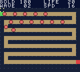

<!--
SPDX-License-Identifier: CC0-1.0
HOLD THE LINE. Dedicated to the public domain; see LICENSE.
-->

# HOLD THE LINE

An element-drafting tower defence for the Game Boy Color, for one player or for
two over a link cable.

**This is in progress and is not a game yet.** What is here is the board, creeps
that walk it, and the checks. There are no towers. `DESIGN.md` beside this file is the spec it
is being built against, and is worth reading first.



## The one sentence

You do not buy towers. You earn one element per wave, and the elements you have
decide what you are allowed to build.

Four elements, Fire, Water, Earth and Nature, so the draft is one press of the
d-pad. Four pure towers and the six pairs between them.

## What works today

- The board: fourteen cells by seventeen, one 8x8 tile each, with the interface
  in a panel down the right rather than a strip across the top. The screen is 20
  tiles by 18; the panel takes six columns, which is what buys the board all
  eighteen rows instead of sixteen.
- A map is a picture in `src/data.s`, ten characters by eight rows, and the
  route creeps walk is **derived from it** rather than written beside it.
- Creeps that walk that route, leak at the exit, and cost you a life when they
  do. Waves arrive on a loop and the counter moves.
- A build cursor that moves and stops at the edges.

A creep is a waypoint index and a fraction of the way to the next one, so the
carry out of a single eight-bit addition is exactly "it reached the next
waypoint" and a corner needs no special case at all. That is the reason the
route is stored as waypoints rather than as pixel coordinates.

## What is not built yet

Towers, the element draft, the economy, a real wave table, sound, and the link
cable. In roughly that order.

### The open question towers run into

A Game Boy Color has **eight background palettes**, and this cartridge already
spends five of them on the interface, ground, path, spawn and exit. Ten tower
types therefore cannot each have their own colour, whatever size they are drawn
at, so their silhouettes have to carry most of the difference.

At one 8x8 tile per cell that is a hard ask. Ten readable silhouettes in
sixty-four pixels, still readable on a monochrome Game Boy, is probably four to
six rather than ten.

The likely answer is that a tower occupies **2 by 2 cells** while the path stays
one cell wide, which is also what the reference games look like: four tiles of
silhouette, a coarser build grid to move a cursor around, and a cell is
buildable only when all four of its quarters are. That is a decision for when
towers get built, not before.

## The route is derived, and that is checked three ways

The picture is the only place the route is written down. Nobody maintains a list
of coordinates that has to keep agreeing with a map, because that is a thing
that stops being true quietly.

The cost of deriving it is that the cartridge believes the picture: a fork or a
gap in a map produces a route that is wrong rather than a build that fails, and
neither is visible by looking at the map. So:

1. **`tools/checkmap.py`** proves the picture is sound before it ships. Exactly
   one `S` and one `E`; the two ends touching one path cell each and every other
   path cell touching exactly two, which is what rules out a fork and a dead
   end; the walk from `S` reaching `E`; and that walk visiting every path cell,
   which is what rules out a second loop stranded elsewhere on the board.
2. **`crates/gb-core/tests/hold_the_line.rs`** runs the actual cartridge in the
   actual core and reads the derived route back out of work RAM. `checkmap.py`
   is a second implementation in another language, and a second implementation
   agreeing with itself is not the claim; the claim is that the code on the
   cartridge gets the same answer.
3. `tools/mapdraw.html`, which applies the same rules as you draw.

They agree that map 1 is a 106 cell route, so the number in the test is an
absolute one rather than something derived from the route it is checking. The
test also asserts both ends are on the top edge, because a map that quietly grew
its ends somewhere else would pass every other check and simply be a different
game.

This is not hypothetical. The first draft of this switchback had its top
corridor ending one column short of the connector below it, so the two were
diagonal and never met. Every other property held: no forks, no dead ends, a
perfectly well formed route. It was simply a route that stopped a fifth of the
way along, and creeps would have walked to the gap and stood there. `checkmap.py`
named both cells in one line.

The addresses those tests read come from the committed `.sym` file, not from
constants, because work RAM moves every time the game grows a variable and a
test that silently reads the wrong byte is worse than no test at all.

## Playing with it while it is being built

On Windows, `play.cmd` in this directory checks the map, assembles, and opens the
cartridge in a window. Arrows move the build cursor, and **Select steps the creep
speed** with the number live in the status bar, because the right speed is a
thing to find by watching rather than by reasoning about.

`tools/mapdraw.html` is a map editor. Open it in a browser; it needs nothing and
talks to nothing. Draw, and it tells you as you go whether a creep could actually
walk what you have drawn, using the same rules `checkmap.py` applies at build
time. When it is happy, paste the block it gives you into `src/data.s`.

## Building it

Nothing outside this repository is needed. No RGBDS, no assembler to install.
Python is only for the map check and the tile generator, neither of which the
build itself requires.

```sh
scripts/build-hold-the-line.sh          # checks the maps, then assembles
```

or by hand, from the repository root:

```sh
cargo run -p gb-asm -- roms/hold-the-line/src/main.s \
    -o roms/hold-the-line/hold-the-line.gbc -s
```

`-s` writes the `.sym` listing beside the ROM, which the tests read.

```sh
cargo test -p gb-asm  --test hold_the_line_reproduces
cargo test -p gb-core --test hold_the_line
```

## A map is a picture

```
map_1:
  .str "S.........+++E"
  .str "+.+++.+++.+..."
  .str "+.+.+.+.+.+..."
  .str "+.+.+.+.+.+..."
  .str "+.+.+.+.+.+..."
  .str "+.+.+.+.+.+..."
  .str "+.+.+.+.+.+..."
  .str "+.+.+.+.+.+..."
  .str "+.+.+.+.+.+..."
  .str "+.+.+.+.+.+..."
  .str "+.+.+.+.+.+..."
  .str "+.+.+.+.+.+..."
  .str "+.+.+.+.+.+..."
  .str "+.+.+.+.+.+..."
  .str "+.+.+.+.+.+..."
  .str "+.+.+.+.+.+..."
  .str "+++.+++.+++..."
```

`S` is where creeps enter, `E` is where they leave and it costs you a life, `+`
is path, `.` is ground you can build on. In at the top and out at the top, the
way Element TD does it. **106 cells of route and 132 to build on.**

This one is a placeholder while the real map gets drawn in `tools/mapdraw.html`.

**A corridor is one cell wide, always.** That is the rule that catches people
out, because a two-cell-thick corridor looks like a nicer path and is not a path
at all: every cell in it touches three or four other path cells, so the route
forks at every step and the walk has no single answer to follow. One cell is
eight pixels, which is exactly one creep across, so it is also what looks right
on the screen.

Nothing is packed, indexed or compiled by hand. The assembler's `.str` directive
already emits ASCII minus $20, which is exactly an index into a 64-byte lookup
table, so a map is edited by editing the picture of it.

## The two-player plan

The short version, with the reasoning in `DESIGN.md`: at connect the host rolls
a seed and sends it, both cartridges seed the same generator, and from then on
**both players face an identical wave schedule without another byte crossing the
wire.** Each side simulates only its own board. The cable carries a status
heartbeat and one event, which is that calling a wave early sends the opponent
creeps.

There is no lockstep, so there is no desync to get wrong, and single player is
the same code with the cable unplugged.

`local_pair()` in `gb-core` wires two cores together in one process, so the two
player mode will be a `cargo test` rather than something that needs two consoles
and a cable.

## Layout

```
src/main.s      code
src/data.s      maps, palettes, and what a map character means
src/tiles.s     the character set and the board graphics, as text art
tools/gentiles.py    regenerates src/tiles.s
tools/checkmap.py    proves every map is one a creep can walk
screenshots/    rendered by the headless harness
DESIGN.md       the spec
```

## Licence

Dedicated to the public domain under [CC0 1.0](LICENSE). Use it for anything, no
attribution required, no permission to ask for.

The only bytes here that are not original are the 48 at `$0104`, which are the
Game Boy's boot logo. Every cartridge that runs on the hardware carries them.
