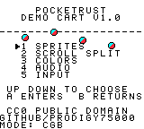
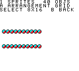
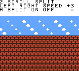
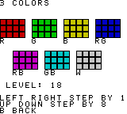
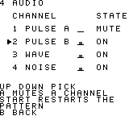
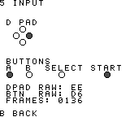

<!--
SPDX-License-Identifier: CC0-1.0
PocketRust Demo Cart. Dedicated to the public domain; see LICENSE.
-->

# PocketRust Demo Cart

A freely distributable Game Boy Color cartridge, written from scratch for this
project, for anyone who needs a ROM they are allowed to ship.

**[`pocketrust-demo.gbc`](pocketrust-demo.gbc)**: 32,768 bytes, no mapper,
colour-enhanced (`$80` at `$0143`), so it uses colour on a Game Boy Color and
still runs on a monochrome Game Boy. Runs on real hardware and on any emulator.

It is not a game. It is five screens, each of which puts one part of the machine
under load so that a person looking at the screen can tell whether the emulator
got it right.

## Why it exists

Every emulator needs a test ROM, and almost every test ROM in circulation is
either a commercial game nobody can legally redistribute or a homebrew of
uncertain provenance. That is fine on your own desk and a problem the moment you
have to hand someone a working demonstration: a reviewer, a store, a colleague.

So this cartridge is the answer to "show me it works, with something you are
allowed to give me." It is original work, dedicated to the public domain under
[CC0 1.0](LICENSE), with a signed [statement of permission](PERMISSION.md) and a
build that anyone can reproduce byte for byte from the source in this directory.

Use it for anything. No attribution required, no permission to ask for.

## The screens

Up and Down choose, A or Start enters, B goes back to the menu.

| | |
|---|---|
|  | **Menu.** Four objects idle on the rule, so you can tell at a glance that object rendering is alive before you pick anything. The bottom line is the only thing on screen the cartridge does not decide: it reads back what the machine said it was at reset, `$11` for a Game Boy Color and `$01` for a monochrome one. |
|  | **1 Sprites.** 40 objects. `A` cycles four arrangements: two counter-rotating rings, two rows of twenty, the same rows with the object buffer rotating under them, and a full-width sine wave. The rows are the interesting one. The hardware draws ten objects per scanline and drops the rest, so exactly half of each row should vanish, and the half that survives is the half that comes first in the object buffer rather than the half furthest left. `Select` switches to 8x16 objects. |
|  | **2 Scroll Split.** A status bar held still over a playfield that scrolls under it, using an LY-compare interrupt that waits for the horizontal blank of scanline 31 before moving the scroll. Left and Right change speed, including reverse; `A` switches the split off so you can watch the bar scroll away with everything else. The Game Boy has one background map and wraps it, so what leaves the right edge comes back on the left: there is no second nametable to walk into here. |
|  | **3 Colors.** Seven background palettes, live: red, green, blue, then each pair, then all three, at an intensity the d-pad moves through the 5-bit range. Every bit position in the 15-bit colour word gets exercised, and the writes go through the palette port with auto-increment, in the vertical blank. On a monochrome Game Boy the same screen shows the four shades and cycles BGP instead. |
|  | **4 Audio.** All four channels: two pulses with different duties, the wave channel playing a waveform uploaded to its sample memory, and noise keeping time. Up and Down pick a channel and `A` mutes it by clearing its envelope byte, which is also its digital-to-analogue converter switch, so a muted channel is off rather than quiet. `Start` restarts the pattern. The meter beside each channel goes to full when that channel is struck and falls back over the six frames after, so the pattern is visible with the sound off and a muted channel reads as flat. |
|  | **5 Input.** Both halves of the joypad matrix, live, with the raw register byte for each and a frame counter. The pad is read by selecting one half, reading several times so the lines have settled, and inverting the result. |

## Building it

Nothing outside this repository is needed. No RGBDS, no assembler to install,
no Python for the build itself.

```sh
cargo run -p gb-asm -- roms/pocketrust-demo/src/main.s \
    -o roms/pocketrust-demo/pocketrust-demo.gbc -s
```

or, from the repository root:

```sh
scripts/build-demo-rom.sh          # assembles, then rewrites SHA256SUMS
```

`-s` writes a `.sym` listing beside the ROM, which is what you want when reading
a core trace back against the source.

The committed `.gbc` is checked against the committed source on every
`cargo test`:

```
cargo test -p gb-asm --test demo_rom_reproduces
```

That is the whole reproducibility claim, and it fails loudly if a single byte
drifts.

## What the core tests do with it

`crates/gb-core/tests/demo_cart.rs` drives the cartridge through the emulator
and measures the things that are hard to get right and easy to state exactly:

- ten objects render on the crowded scanline and the other ten do not;
- scanline 31 stays put while the playfield scrolls, and moves when the split is
  switched off, so neither half of that can pass by accident;
- a save state taken mid-screen replays ninety frames identically, video and
  audio, and a truncated or foreign one is refused;
- a muted channel contributes exactly zero to the mix, not a held level;
- every screen is reachable and comes back to a menu identical to the one that
  booted.

These are the first core tests here that need no ROM the user has to supply, so
they run on a fresh clone anywhere.

The screenshots above were rendered by the headless harness, and each one is a
one-line recipe you can run again:

```sh
cargo run --release -p gb-runner --bin shot -- \
    roms/pocketrust-demo/pocketrust-demo.gbc 4 shot.png \
    "w200,down,a,w20,right,right,right,w45"
```

## Layout

```
src/main.s      code: reset, the frame loop, the interrupt handlers, five screens
src/data.s      screens, palettes, music patterns, wave samples
src/tiles.s     the character set, drawn as text art (see below)
src/tables.s    generated sine and note-period tables
tools/gentiles.py    regenerates src/tiles.s from the glyph set it contains
tools/gentables.py   regenerates src/tables.s
screenshots/    the images above, rendered by the headless harness
```

The character set is written as pixels, not as hex. A tile looks like this:

```
.tile chr_41
.333....
3...3...
3...3...
33333...
3...3...
3...3...
3...3...
........
```

`.` is colour 0 and `1` `2` `3` are the three drawable colours of whichever
palette the tile is rendered with. The assembler turns each block into the Game
Boy's two-bitplane tile format, which interleaves the planes row by row rather
than keeping them eight bytes apart the way the NES does. Every glyph and every
graphic in this cartridge is visible in `src/tiles.s` as the picture it is,
which is the point: you can see for yourself that none of it came from anywhere
else.

The font is laid out so that a tile index is exactly its character code minus
`$20`, which is why the source can write screen text as text.

The two `tools/` scripts exist only so that a glyph can be edited as a compact
block and still come out with every row exactly eight pixels wide. Their output
is checked in and is perfectly readable on its own; you never need to run them
to build the ROM.

## The toolchain piece

`gb-asm` (in `crates/gb-asm/`) is a small two-pass SM83 assembler written for
this cartridge. It has no dependencies at all, which is deliberate: the chain
from source to `.gbc` is entirely inside this repository, so the binary being
distributed carries no third-party licensing question anywhere in its path. It
is the sibling of `nes-asm` in the FamiRust repository, which does the same job
for the same reason on a 6502.

It assembles the documented instruction set and nothing else: the eleven opcodes
no Game Boy instruction decodes to have no spelling here and cannot be written.

Beyond the usual directives it has three worth knowing about:

- `.tile` / `.endtile`, the text-art block above.
- `.ram <addr>`, which switches to handing out addresses without emitting bytes.
  A cartridge cannot ship the contents of work RAM, so the whole variable map is
  declared this way and the reset routine clears it.
- `.assert <expr>, "message"`, evaluated once every label is final. The cartridge
  uses it to pin its own layout: that no tile got inserted into the middle of the
  font and quietly shifted every graphic constant after it, that the object
  buffer still starts on a page boundary (the transfer controller only takes the
  high byte, so it has to), that the transfer routine still fits in the corner of
  high RAM it is copied to.

## Licence

CC0 1.0 Universal. See [`LICENSE`](LICENSE) for the dedication and
[`PERMISSION.md`](PERMISSION.md) for a plain-language statement of authorship and
permission, including the one 48-byte exception: the header logo the console's
boot ROM checks for, which every Game Boy cartridge carries and which is
Nintendo's rather than ours.

Note that the demo cart is CC0 while the emulator core around it is GPL-3.0.
That is on purpose. The core's licence is a choice about the emulator; the
cart's job is to be a thing nobody has to think about before shipping it.

"Game Boy", "Game Boy Color" and "Nintendo" are trademarks of Nintendo.
PocketRust is an independent, clean-room reimplementation and is not affiliated
with or endorsed by Nintendo.
